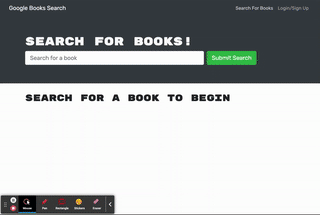

# react-MERN-project

Homework 17 - React MERN Project

## what did I do?

This assignment required finishing a GraphQL project that had been started for us. ApolloServer, typeDefs, resolvers, useQuery, and useMutation were the new concepts/things introduced to us for this particular project.

## what do I need to explain

This project was deployed on Heroku and uses Mongo Atlas. This project was also simplified for us because our class is running behind. Portions of this project are working and portions are not.

## heroku deployment link

https://google-books-bretpeters3n.herokuapp.com/

## animated GIF project walk through

[]
